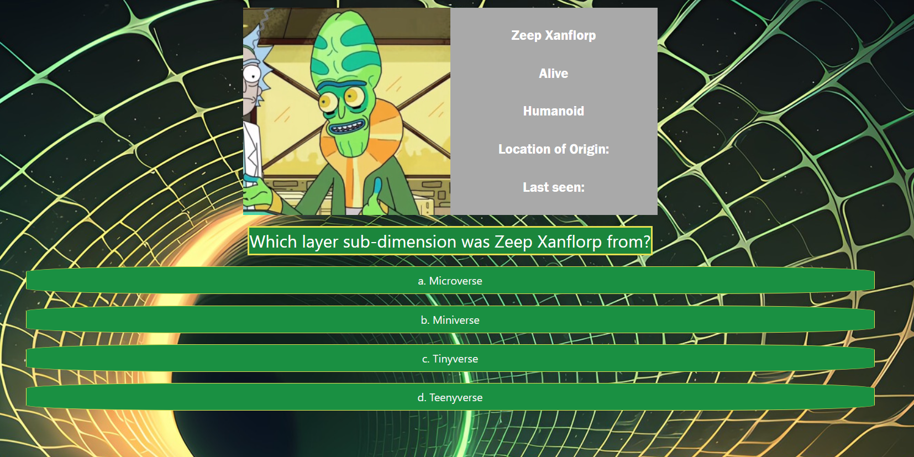

# TRICKvial MORTsuit

## Description

##  Installation

N/A, it's a webpage.

## Usage

The webpage can be found [here](https://wolfspiderman.github.io/t-rick-vial-mort-suit/).

When the user loads the page, they will only see the header of the page, and a button that looks suspiciously like some cheap knock off of one of Rick's probably trademarked portals.

The following is a screenshot of the page in the middle of the quiz:

    
## cited-sources
1. https://rickandmortyapi.com
2. https://insult.mattbas.org/api/
3. https://codepen.io/nicktayloruk/pen/MWaxMEN

## Upcoming Developments

Adding bonus question(s) that are non-multiple choice, such as a drag-n-drop 'put them in the right order' type questions. Making high scores public. Changing how points are earned; earned more points for quicker answers, rather than only for correct answers.
